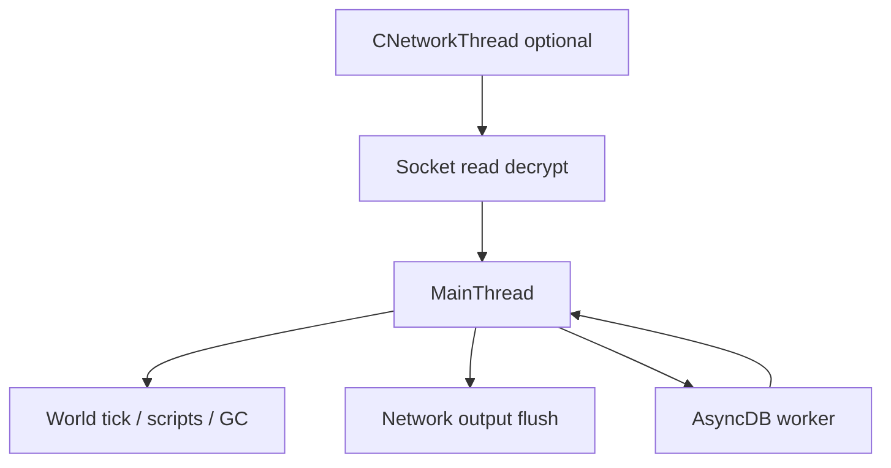

# Source-X Architecture

Internal reference for contributors. Describes how the server is structured today and the target layering direction.

## Directory layers

| Layer | Path | Responsibility |
|-------|------|----------------|
| **common** | `src/common/` | Types, strings, script engine, resources, crypto, SQLite wrapper |
| **game** | `src/game/` | World, characters, items, clients, sectors |
| **network** | `src/network/` | Packets, sockets, client I/O |
| **sphere** | `src/sphere/` | Process entry, main loop, threads, async DB worker |
| **tables** | `src/tables/` | `.tbl` definitions for props, triggers, functions |

**Target rule:** `common` must not `#include` from `game/` or `sphere/`. Legacy upward includes are being removed incrementally; see `utilities/check-layering.sh`.

## Global singletons

| Global | Type | Owner / lifetime | Thread |
|--------|------|------------------|--------|
| `g_Serv` | `CServer` | Process; init in `spheresvr.cpp` | Main |
| `g_World` | `CWorld` | Process; owns UID object table | Main |
| `g_Cfg` | `CServerConfig` | Process; script resources | Main (reload on main) |
| `g_Log` | `CLog` | Process | Any (serialized internally) |
| `g_NetworkManager` | `CNetworkManager` | Process | Main + network threads |
| `g_Accounts` | `CAccounts` | Process | Main |
| `g_ExprGlobals` | `CExprGlobals` | Process; expression `<TAG>` resolution | Main |
| `g_Install` / `g_MapList` / `g_VerData` | UO file readers | Process | Main |
| `g_asyncHdb` | `CDataBaseAsyncHelper` | Process; async SQL queue | DB worker + main |
| `g_ExprGlobals` | guarded globals for scripts | Process | Main |

Non-owning pointers (`CChar*`, `CItem*`) into the world are resolved via `CUID::CharFind()` / `ItemFind()` — ownership stays in `g_World` until deferred GC.

## Threading model

- **Main thread** owns all mutable game state (`g_World`, characters, items).
- **Network threads** (if enabled) read/decrypt; packet handlers run on main thread in typical configs.
- **Async DB** executes SQL on a worker; results delivered on main tick.
- `MT_ENGINES=0` in `basic_threading.h` — engine mutex macros are no-ops today.

## Object lifecycle

1. `CChar::CreateBasic` / `CItem::CreateBase` → `new` + UID registration in `g_World`
2. Unplaced objects sit in `m_ObjNew` until placed or GC
3. `CObjBase::Delete()` → deferred `ScheduleObjDeletion`
4. `GarbageCollection_UIDs` validates and `delete`s; `CObjBase::sm_iCount` must match UID table

## Script capability matrix

Scripts (`CScriptObj`, `.scp` resources) can reach:

| Capability | Access | Gate |
|------------|--------|------|
| Game objects | `@trigger`, `UID`, `OBJ`, `ARGO` | Trigger context |
| Accounts | `ACCOUNT`, `REFn` | Privilege checks on `CAccount` |
| MySQL | `DATABASE.QUERY`, `DATABASE.EXECUTE` | **PLEVEL_Admin** (see `CDataBase::r_Verb`) |
| SQLite | `LOCALDB.*`, `MEMORYDB.*` | **PLEVEL_Admin** |
| Files | `FILE.*` | `OF_FileCommands` + priv |
| OS spawn | `SYSCMD`, `SYSSPAWN` | `OF_FileCommands` |
| HTTP pages | `@Load` on web templates | Account + `m_privlevel` on page def |

Recursion limit: 75 nested triggers (`CScriptObj.cpp`). No per-trigger CPU budget.

## Build variants

| Type | Use |
|------|-----|
| **Release** | Production shard |
| **Nightly** | Pre-release; asserts + callstack |
| **Debug** | Development; sanitizers recommended |

See [contributing.md](contributing.md) and [memory-audit-baseline.md](memory-audit-baseline.md).
