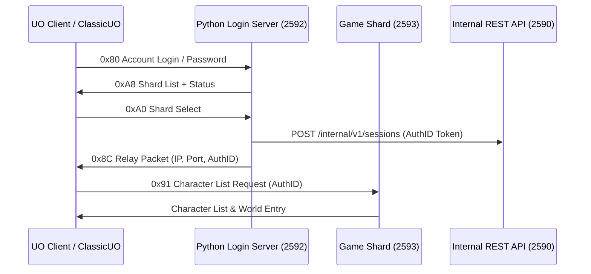

# External Login Server Microservice & Authentication

**SphereServer X** (`Source-X`) features a decoupled **Python Multi-Shard Login Microservice** (`services/login-server/`). This architecture isolates account authentication, seed handshake, and server selection from individual game shard processes.

---

## 1. Architecture Overview



### Key Benefits

1. **Isolation & Resilience**: If the login service crashes or restarts, online players on game shards remain completely uninterrupted.
2. **Multi-Shard Architecture**: A single login server can serve multiple game shards (e.g. Felucca, Trammel, Custom Shard 1), reporting live player populations for each.
3. **Database Flexibility**: Support for local SQLite databases or high-performance central MariaDB databases.
4. **C++ Native Crypto Integration**: Accelerated packet crypto via `sphere_login_crypto` native library binding.

---

## 2. Port Allocation & Security

| Service | Port | Default | Exposure | Security Gate |
|---------|------|---------|----------|---------------|
| **Login Microservice** | Public | `2592` | Internet | Account/Password rate-limiting |
| **Game Shards** | Public | `2593+` | Internet | `UseExternalLogin=1` & AuthID validation |
| **Internal REST API** | Private | `2590+` | **Localhost Only** | `Bearer <LoginSharedSecret>` HTTP Header |

> [!WARNING]
> Do **NOT** expose the Internal REST API port (`2590`) to the public internet. Restrict access strictly to `127.0.0.1` or isolated private network interfaces between your login server and game shard nodes.

---

## 3. Game Shard Setup (`sphere.ini`)

Configure the game shard process to require external authentication:

```ini
UseAuthID=1
UseExternalLogin=1
InternalApiPort=2590
LoginSharedSecret=YourSuperSecretKeyHere
ShardDisplayName=Felucca Shard
```

- `UseExternalLogin=1`: Rejects direct `0x80` login packets on the game port, allowing connections ONLY if accompanied by a valid pre-registered `AuthID` token.
- `InternalApiPort`: Enables `CInternalApiServer` on the specified port.
- `LoginSharedSecret`: Shared secret string for HMAC bearer token verification.

---

## 4. Login Server Setup

### 4.1 Installation & Configuration

```bash
cd services/login-server
pip install -r requirements.txt
cp config.json config.local.json
python login_server.py -c config.local.json
```

### 4.2 Configuration File (`config.json`)

```json
{
  "listen_host": "0.0.0.0",
  "listen_port": 2592,
  "shared_secret": "YourSuperSecretKeyHere",
  "md5_passwords": false,
  "status_poll_seconds": 30,
  "accounts": {
    "sqlite": "login.db"
  },
  "shards": [
    {
      "name": "Felucca Shard",
      "host": "127.0.0.1",
      "port": 2593,
      "internal_url": "http://127.0.0.1:2590",
      "timezone": 0
    }
  ]
}
```

---

## 5. Account Storage Options

### 5.1 SQLite (Local / Development)

Import existing `sphereacct.scp` into SQLite database:

```bash
python services/login-server/import_accounts.py packaging/debian/data/sphereacct.scp \
  --sqlite services/login-server/login.db
```

### 5.2 MariaDB (Production Multi-Shard)

1. Create schema:
   ```bash
   mysql -u root -p myshard < services/login-server/sql/accounts.sql
   ```
2. Import account accounts:
   ```bash
   python services/login-server/import_accounts.py accounts/sphereacct.scp \
     --user login --password secret --database myshard
   ```
3. Update `config.json` database settings.

---

## 6. Native C++ Crypto Shared Library (`sphere_login_crypto`)

For maximum performance under heavy login throughput, build the C++ native helper library:

```bash
cmake -B build -DBUILD_LOGIN_CRYPTO=ON
cmake --build build --target sphere_login_crypto
```

The compiled library (`sphere_login_crypto.dll` or `libsphere_login_crypto.so`) provides hardware-accelerated seed and login packet encryption/decryption routines. If omitted, the Python service automatically uses its fallback pure-Python crypto implementation.

---

## 7. Related Core Source Files

- `src/game/clients/CSessionRegistry.cpp` / `.h` — Ephemeral AuthID session token tracking
- `src/network/CInternalApiServer.cpp` / `.h` — Game shard HTTP REST API endpoint
- `src/game/clients/CClientLog.cpp` — AuthID token validation gate on client connection
- `services/login-server/login_server.py` — Main Python microservice process
- `services/login-crypto/` — C++ shared crypto module
