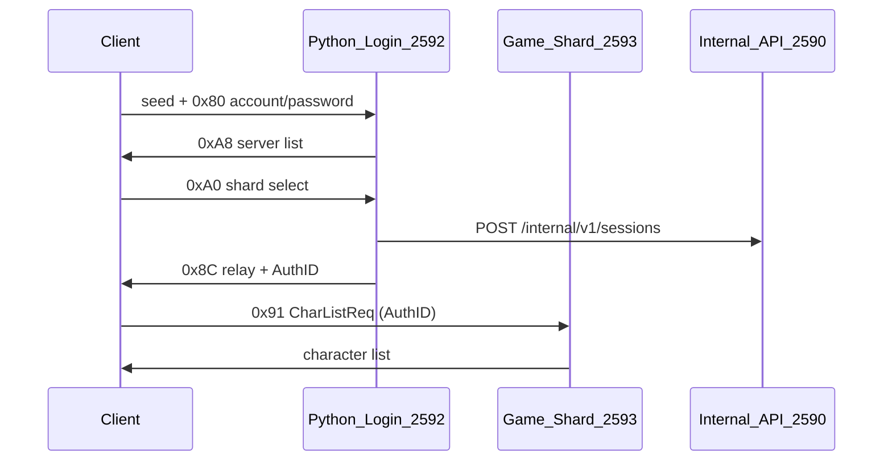

# External login server (multi-shard)

Source-X can run account login on a separate **Python login service** while each game shard continues to handle character selection and gameplay. If the login service stops, players already in-world stay connected; only new logins fail until it restarts.

## Architecture



## Ports

| Service | Default port | Exposure |
|---------|--------------|----------|
| Login server | 2592 | Public (clients connect here) |
| Game shard | 2593+ | Public (after relay) |
| Internal API | 2590+ | **localhost / private network only** |

## Game shard configuration (`sphere.ini`)

```ini
UseAuthID=1
UseExternalLogin=1
InternalApiPort=2590
LoginSharedSecret=change-me
ShardDisplayName=Felucca
```

- `UseExternalLogin=1` — rejects 0x80 account login on the game port; only accepts AuthID sessions registered by the login server.
- `InternalApiPort` — starts the localhost HTTP API (`CSessionRegistry` + `CInternalApiServer`).
- `LoginSharedSecret` — must match the login server config.
- `ShardDisplayName` — reported in `/internal/v1/status` for the server list load percentage.

## Login server setup

```bash
cd services/login-server
pip install -r requirements.txt
cp config.json config.local.json   # edit shared_secret, shards, accounts path
python login_server.py -c config.local.json
```

### `config.json`

```json
{
  "listen_host": "0.0.0.0",
  "listen_port": 2592,
  "shared_secret": "change-me",
  "md5_passwords": false,
  "status_poll_seconds": 30,
  "accounts": {
    "scp_path": "../../accounts/sphereacct.scp"
  },
  "shards": [
    {
      "name": "Felucca",
      "host": "127.0.0.1",
      "port": 2593,
      "internal_url": "http://127.0.0.1:2590",
      "timezone": 0
    }
  ]
}
```

For multiple shards, add more entries under `shards`. Each game process needs its own `ServPort` and `InternalApiPort`.

### SQLite accounts (local testing)

No extra Python packages — uses the stdlib `sqlite3` module.

1. Import from `sphereacct.scp` (creates the DB and schema):

```bash
python services/login-server/import_accounts.py packaging/debian/data/sphereacct.scp \
  --sqlite services/login-server/login.db
```

2. Point login server at SQLite:

```json
"accounts": {
  "sqlite": "login.db"
}
```

Or copy the ready-made example:

```bash
python login_server.py -c config.sqlite.json
```

### MariaDB shared accounts (production)

1. Create schema:

```bash
mysql -u root -p myshard < services/login-server/sql/accounts.sql
```

2. Import from `sphereacct.scp`:

```bash
python services/login-server/import_accounts.py accounts/sphereacct.scp \
  --user login --password secret --database myshard
```

3. Point login server at MariaDB:

```json
"accounts": {
  "mysql": {
    "host": "127.0.0.1",
    "port": 3306,
    "user": "login",
    "password": "secret",
    "database": "myshard"
  }
}
```

## Native crypto helper (optional)

Build the shared library with CMake:

```bash
cmake -B build -DBUILD_LOGIN_CRYPTO=ON
cmake --build build --target sphere_login_crypto
```

Set `SPHERE_LOGIN_CRYPTO_PATH` to the directory containing `sphere_login_crypto.dll` / `libsphere_login_crypto.so`. If the library is missing, the login server falls back to pure Python packet builders and legacy login XOR crypto.

**Note:** Full Blowfish/Twofish client matrix from `Crypt.ini` is not yet ported. Test with your target client; legacy XOR covers many ClassicUO / older handshake paths.

## Internal HTTP API (game shard)

### `POST /internal/v1/sessions`

```
Authorization: Bearer <LoginSharedSecret>
Content-Type: application/json

{
  "account": "player",
  "auth_id": 2847591023,
  "client_version": 0,
  "reported_version": 7000000,
  "ttl_seconds": 30
}
```

### `GET /internal/v1/status`

Returns player count and percent full for the login server list. Polled every `status_poll_seconds` by the login service.

## Client configuration

Point the UO client / ClassicUO at the **login server** IP and port (2592), not the game shard port. The relay packet sends the client to the correct shard after selection.

Example `serverlist.txt` / freeshard list entry:

```
MyShard Login
your.login.host
2592
```

## systemd examples

`/etc/systemd/system/sourcex-login.service`:

```ini
[Unit]
Description=Source-X Login Server
After=network.target

[Service]
Type=simple
WorkingDirectory=/opt/source-x/services/login-server
ExecStart=/usr/bin/python3 login_server.py -c /etc/source-x/login.json
Restart=on-failure

[Install]
WantedBy=multi-user.target
```

Game shards keep using your existing `sphereserver.service` unit; no dependency on the login unit (isolation goal).

## Firewall

- Allow **2592/tcp** to the login host (public).
- Allow **2593+/tcp** to game hosts (public).
- Do **not** expose **2590** (internal API) to the internet; restrict to login host → game host private network.

## Troubleshooting

| Symptom | Check |
|---------|--------|
| `BadAuthID` on character screen | Login server failed to register session; verify `LoginSharedSecret`, `InternalApiPort`, firewall to localhost |
| Login works, shard list empty | `config.json` `shards` array; login server logs |
| `AuthID is not correct` with external login off | Enable `UseExternalLogin=1` on shard |
| Stuck at login | Client crypto mismatch; try building `sphere_login_crypto` or test with no-crypt client settings |

## Related code

- `src/game/clients/CSessionRegistry.*` — session token store
- `src/network/CInternalApiServer.*` — HTTP API thread
- `src/game/clients/CClientLog.cpp` — AuthID validation / external login gate
- `services/login-server/login_server.py` — Python login service
